the interrupt system key point:
1. interrupt service table
2. GIC(general interrupt controller)
3. enable interrupt
4. interrupt handler(Function)
interrupt service table：
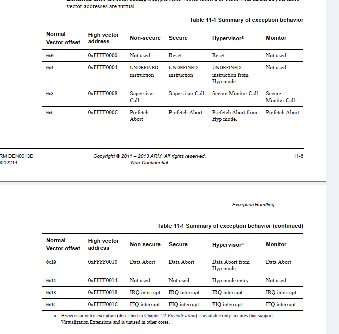

how to configure the CPSR
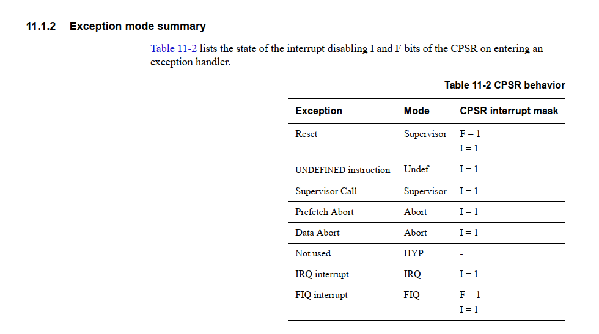

The default vector base address is 0x00000000, but we start at the 0x80000000, and most ARM cores permit to move to 0xffff0000, The offset set is through CP15 register.
CP15 寄存器：用于设置向量基址。在支持安全扩展的处理器核心中，可以分别为安全和非安全状态设置向量基址。这增加了灵活性和安全性，允许系统根据当前执行状态使用不同的异常处理代码。  
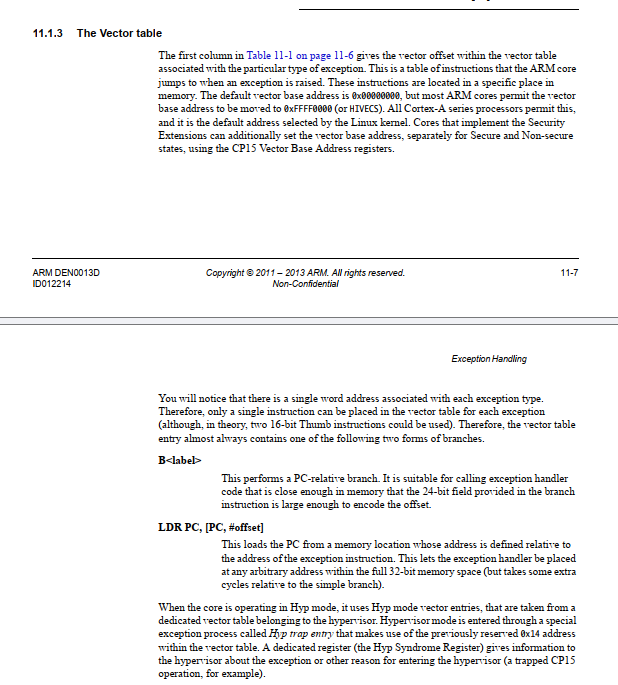

# Next is the FIQ and IRQ.  
FIQ is reserved for interrupt that requires a guaranteed fast response time.  
1.  the FIQ handler can be placed diectly at the vector location and run sequentially from the address.
2. KEY difference between FIQ and IRQ is that FIQ handler is not excepted to generate any other exceptions.(So FIQ can be used only by code that does't use kernel API)  

# the return instruction exception handling
The Link Register(LR) is used to store address that return for the exception handled. Its value is like next img.
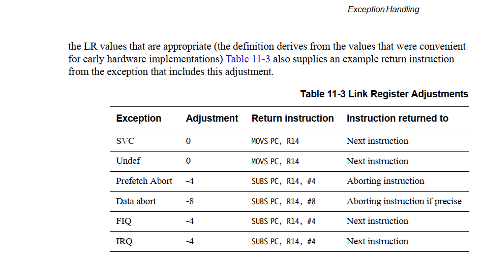


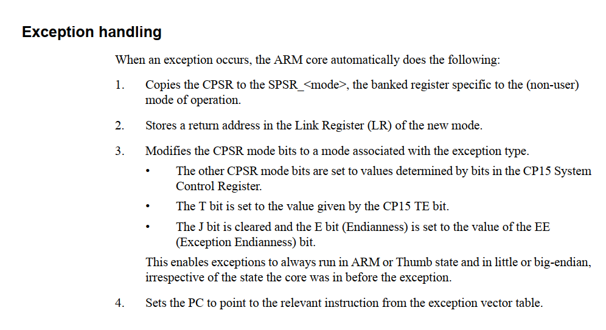
异常处理的自动操作：
复制 CPSR 到 SPSR_<模式>：

当异常发生时，当前的程序状态寄存器（CPSR）被复制到特定于新模式的已存程序状态寄存器（SPSR）。SPSR 保存了异常发生时的处理器状态，以便异常处理完成后能恢复到原始状态。
存储返回地址到新模式的链接寄存器（LR）：

返回地址，即异常发生时下一条指令的地址，被存储在新模式的链接寄存器中。这保证了异常处理完成后，程序能从正确的位置继续执行。
修改 CPSR 的模式位：

根据异常类型，CPSR 的模式位被修改，以切换到适当的处理模式（如 IRQ 模式、SVC 模式等）。
其他的 CPSR 模式位根据 CP15 系统控制寄存器中的位设置而定。
T 位（指示接下来的指令是否应以 Thumb 模式执行）根据 CP15 的 TE 位设置。
J 位被清除，并且 E 位（指示字节序）被设置为 EE 位的值，确保异常可以在 ARM 或 Thumb 状态下以小端或大端模式执行，无论核心之前的状态如何。
设置程序计数器（PC）：

PC 被设置为指向异常向量表中相应异常的入口点。这保证了处理器跳转到正确的处理程序来响应当前的异常。

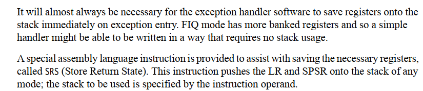
我们需要存储一些寄存器到栈上，因为我们在处理异常的时候需要使用到一些寄存器。
在处理完异常后，从栈中弹出。
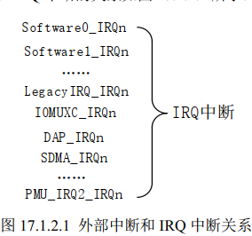
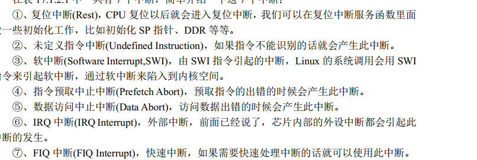

# interrupt handling
```
IRQ_Handler
PUSH {r0-r2, lr}    ; 保存寄存器和链接寄存器
BL identify_and_clear_source    ; 调用函数以识别和清除中断源
POP {r0-r2, lr}     ; 恢复寄存器和链接寄存器
SUBS pc, lr, #4     ; 通过修改 LR 的值准备返回到中断前的位置
```
简单中断处理步骤：
中断触发：

当外部硬件触发 IRQ 中断时，处理器自动执行一系列操作。这包括将当前执行模式下的程序计数器（PC）的内容保存到链接寄存器（LR）中，并将当前程序状态寄存器（CPSR）的内容复制到 SPSR（保存程序状态寄存器）。
设置中断模式：

CPSR 的模式位被设置为 IRQ 模式，I 位被设置以屏蔽其他 IRQ 中断，PC 被设置为中断向量表中的 IRQ 处理函数入口。
保存上下文：

在中断处理函数开始时，需要保存所有重要的寄存器到栈上。这通常包括通用寄存器和可能影响的状态寄存器。
执行中断处理：

中断服务例程（ISR）识别中断源，并执行相应的处理，如读取数据，清除中断标志，或者调用更具体的设备驱动程序。
恢复上下文并返回：

处理完成后，从栈上恢复之前保存的寄存器，通过修改 LR 的值准备退出中断模式，并将 SPSR 的值恢复到 CPSR，然后执行异常返回指令以恢复到中断前的程序执行点。


# GIC
1. 中断源
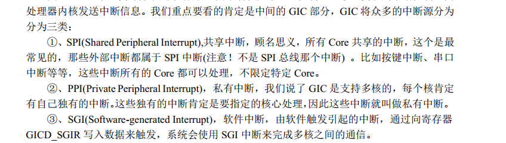

2. 中断ID
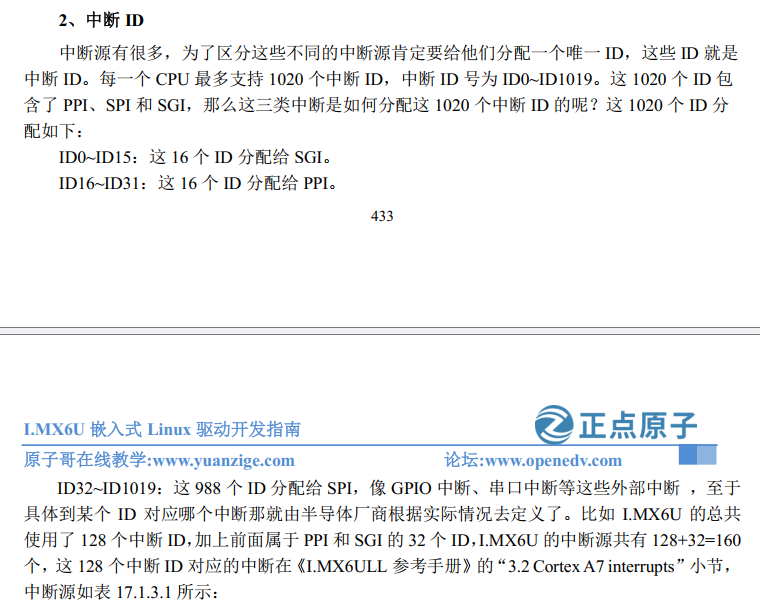

3. CP15 **coprocessor**

ARM ArchitectureReference Manual ARMv7-A and ARMv7-R edition.pdf p1469
Cortex-A7 Technical ReferenceManua.pdf
p68
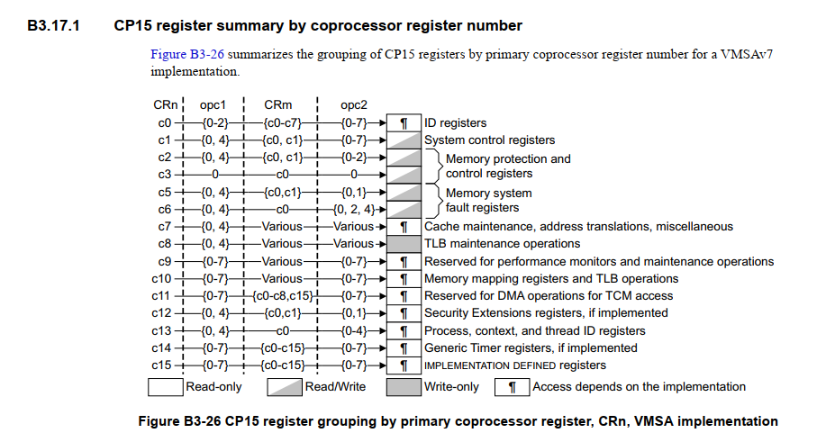
```
MCR{cond} p15, <opc1>, <Rt>, <CRn>, <CRm>, <opc2>
```
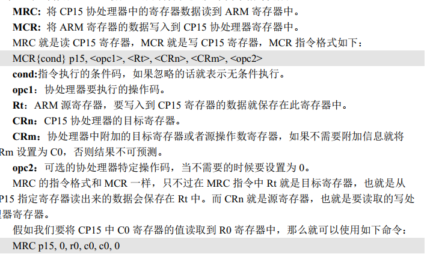

# Quickly enable or disable interrupt 
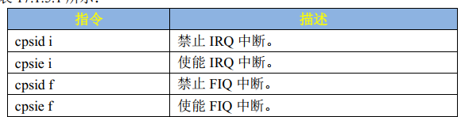
cpsid i(change processor status (disable insterrupt))
cpsie i(change processor status (enable insterrupt))
cpsid f (change processor status (disable fast insterrupt))
cpsie f (change processor status (enable fast insterrupt))

# interrupt priority
```
FORCEDINLINE __STATIC_INLINE void GIC_Init(void)
{
  uint32_t i;
  uint32_t irqRegs;
  GIC_Type *gic = (GIC_Type *)(__get_CBAR() & 0xFFFF0000UL);
/* config base address*/
  irqRegs = (gic->D_TYPER & 0x1FUL) + 1;
/**/
  /* On POR, all SPI is in group 0, level-sensitive and using 1-N model */

  /* Disable all PPI, SGI and SPI */
  for (i = 0; i < irqRegs; i++)
    gic->D_ICENABLER[i] = 0xFFFFFFFFUL;

  /* Make all interrupts have higher priority */
  gic->C_PMR = (0xFFUL << (8 - __GIC_PRIO_BITS)) & 0xFFUL;

  /* No subpriority, all priority level allows preemption */
  gic->C_BPR = 7 - __GIC_PRIO_BITS;

  /* Enable group0 distribution */
  gic->D_CTLR = 1UL;

  /* Enable group0 signaling */
  gic->C_CTLR = 1UL;
}
```

