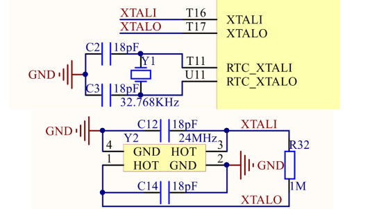

In the default configuration, the I.MX6U operating frequency is 396MHz. However, the standard operating frequency of the I.MX6U series is 528MHz, and some
Models can even operate up to 696MHz.
So we learn how to config frequency and clock.  

This is schematic diagram of clock of the I.MX6U-ALPHA,
The diagram should be found on  the core diagram, but i don't find it.  
So i puzzle........