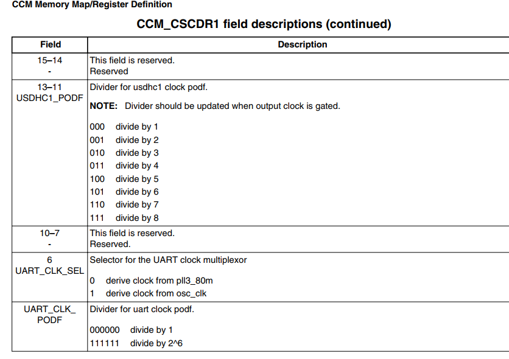
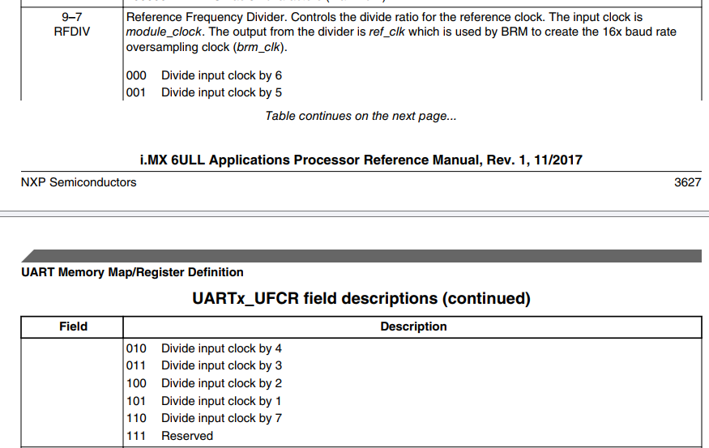
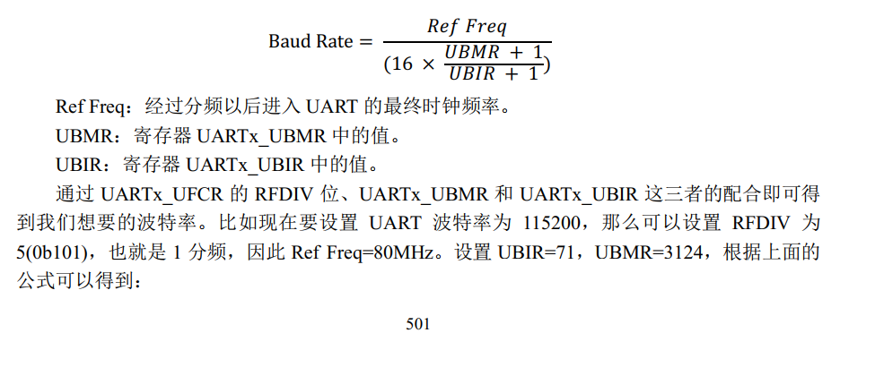

Fisrstly, we start with the diagram

We can jump to the 
[uart_ttl](material/uart_ttl.md)
1. config the clock source of UART.
The clock source of the URAT is configed by the register CCM_CSCDR1 
So we choose the pll3_80m 
UART_CLK_SEL bit 6 0
divider is 1 so bit 5:0=000000
so we 
```
bic CCM_SEL 0x7f
```

# 2. UART_init
    config the register UCR1~3
## uartx_UCR1
**important bit** :

ADBR(bit 14) :Enables automatic detection of the baud rate.
[what is automatic detection](material/autobund.md)
UARTEN(bit 0): enable uart
    config the regitser URXD and the UTXD


## UARTx_UCR2
IRTS(bit14): When it is 0, use the RTS pin function, when it is 1, ignore the RTS pin.
[RTS](material/RTS.md)

PREN (bit8): Parity check enable bit, when it is 0, parity check is turned off, when it is 1, parity check is enabled.

PROE (bit7): Parity check mode bit. After turning on parity check, if this bit is 0, even parity will be used.
After verification, if this bit is 1, odd verification can be performed.

STOP (bit6): The number of stop bits. When it is 0, it is 1 stop bit, and when it is 1, it is 2 stop bits.

WS(bit5): Data bit length, when it is 0, 7-bit data bits are selected, and when it is 1, 8-bit data bits are selected.

TXEN (bit2): Transmit enable bit. When it is 0, it turns off the UART transmission function. When it is 1, it turns on the UART.
sending function.

RXEN (bit1): Receive enable bit. When it is 0, it turns off the UART receiving function. When it is 1, it turns on the UART.
receiving function.

SRST (bit0): software reset. When it is 0, the software resets the UART. When it is 1, it means the reset is completed. reset
After completion, this bit will be automatically set to 1, indicating that the reset is completed. This bit can only be written to 0, writing 1 will be ignored.


## UARTx_UCR3


**import bit**
Bit 2 (RXDMUXSEL):
RXDMUXSEL (Receive DMA Mux Select)
Functionality: This bit is used to select the source for the DMA (Direct Memory Access) operations related to UART reception.
Options:
0: Typically, this setting might direct the UART to use a default or primary DMA channel or source for receiving data.
1: This might switch the input to an alternate DMA channel or source, which could be used in scenarios where multiple DMA paths are available or specific conditions require switching the source to manage data flow differently.
Function: Receive DMA Mux Select
Description: Selects the DMA source for receiving data.
**This bit is always 1**
## UARTx_USR2

bit 3(TXDC):Transmit finish signal bit.
If the bit set 1 indicating the TxFIFO and shift register are empty, also When the transmission is completed, this bit will be automatically cleared when data is written to TxFIFO.

bit 0 (RDR) data receive signal bit.
when it is 1, indicates receive at least 1 data.
After register UART_URXD receive data, the bit will be cleared.


## UARTx_UFCR、 UARTx_UBIR and  UARTx_UBMR
UARTx_UFCR(UART FIFO Control Register) 
UARTx_UBIR(UART BRM Incremental Register)
UARTx_UBMR(UART BRM Modulator Register)
When enabeling the automatic baud rate detection feature, these registers can config the baud rate.
UCFR (bit 9-7 RFDIV)

The divider is similar to the clock divider.

3.  enable UART
UART1_UCR1 bit 0(UARTEN)

4. fuction receive and transmit 

