UART(universal Asynchronous Receiver/Transmitter)  

# URAT transfer format
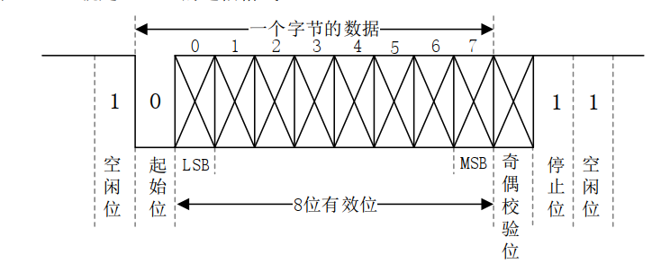
1. Start Bit:

Every UART frame begins with a start bit, which is always 0. This signals the receiver that a new byte of data is starting.

2. Data Bits:

The data is transmitted with the least significant bit (LSB) first and most significant bit (MSB) last. The diagram shows a data frame of 8 bits, which is typical for UART communication.

3. Parity Bit (optional):

A parity bit may be included for error checking. It can be set to either even or odd parity, but in this diagram, the space is left blank, indicating it might be optional or not used.

4. Stop Bits:

The frame ends with one or more stop bits, which are always set to 1. This signals the end of a data byte and allows the receiver time to process the received byte before the next byte starts.

5. Baud Rate: 

The baud rate determines the speed of data transmission, with each unit (baud) representing one signal change (bit) per second

# UART in I.MX6U
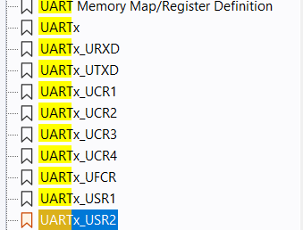
I.MX6U has 8 UARTs, the characteristic is below:
① Compatible(兼容) with TIA/EIA-232F standard, the speed can reach up to 5Mbit/S.
②. Supports serial IR interface, compatible with IrDA, up to 115.2Kbit/s.
③.Support 9-bit or multi-node mode (RS-485).
④, 1 or 2 stop bits.
⑤. Programmable parity (odd and even parity).（(个性化编程)
⑥. Automatic baud rate detection (up to 115.2Kbit/S supported).

The PAD clock is configed by the register **UART_CLK_SEL(bit 6) and UART_CLK_POOF(bit 5:0)bit of register CCM_CSCDR1**,
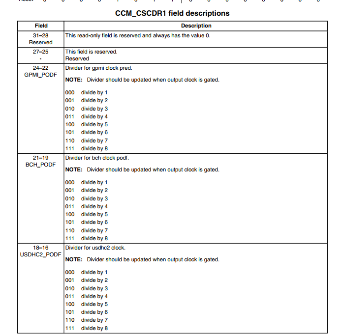
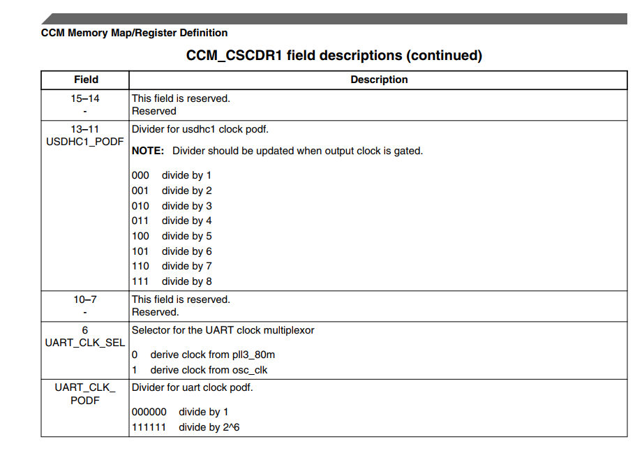

The clock has pll3_80m(80MHz) and osc_clk(24M)
we usually use pll3_80m, and the divider is 1.

## several important registers in UART
1. UART control register
UARTx_UCR1(x=1~8)

## UART1_UCR:
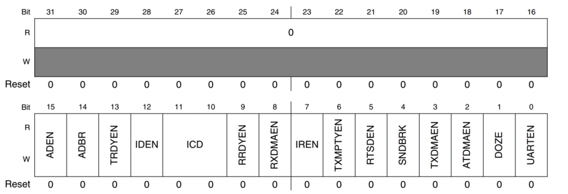
UARTx_UCR1 寄存器的各个位，这里给出它们的全称和功能说明：

UARTEN (UART Enable):

UARTEN (UART Enable)

Bit Position: 0
Description: Controls the enabling of the UART module.
DOZE (Doze Enable)

Bit Position: 1
Description: Controls UART operation in doze mode.
TXDMAEN (Transmit DMA Enable)

Bit Position: 2
Description: Enables DMA for transmitting data.
SNDBRK (Send Break)

Bit Position: 3
Description: Controls the sending of a break signal.
RTSDEN (RTS Delta Enable)

Bit Position: 4
Description: Enables detection of changes in the RTS line.
TXMPTYEN (Transmitter Empty Interrupt Enable)

Bit Position: 5
Description: Enables an interrupt when the transmit buffer is empty.
IREN (IrDA Enable)

Bit Position: 6
Description: Enables IrDA mode for infrared communication.
RDMAEN (Receive DMA Enable)

Bit Position: 7
Description: Enables DMA for receiving data.
RDTYEN (Receiver Ready Interrupt Enable)

Bit Position: 8
Description: Enables an interrupt when the receiver is ready to accept new data.
IDEN (Idle Condition Detect Enable)

Bit Position: 9
Description: Enables detection of idle conditions for interrupt generation.
TRDYEN (Transmitter Ready Interrupt Enable)

Bit Position: 10
Description: Enables an interrupt when the transmitter is ready to send more data.
ADBR (Automatic Detection of Baud Rate)

Bit Position: 12
Description: Enables automatic detection of the baud rate.
ADEN (Automatic Baud Rate Enable)

Bit Position: 13
Description: Enables automatic adjustment of the baud rate based on detected values.

**important bit** :

ADBR(bit 14) :Enables automatic detection of the baud rate.
UARTEN(bit 0): enable uart

## UART2_UCR
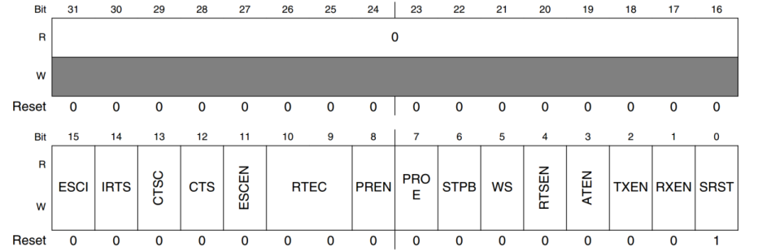
SRST (Software Reset)

Bit Position: 0
Function: Resets the UART when set. A value of '1' typically resets the UART module.
RXEN (Receiver Enable)

Bit Position: 1
Function: Enables the UART receiver. Setting this bit allows the UART to receive data.
TXEN (Transmitter Enable)

Bit Position: 2
Function: Enables the UART transmitter. Setting this bit allows the UART to send data.
ATEN (Automatic Transmitter Enable)

Bit Position: 3
Function: Automatically enables the transmitter under certain conditions, often related to hardware flow control or when the transmit buffer is loaded.
RTSEN (RTS Enable)

Bit Position: 4
Function: Controls the RTS (Request To Send) line. Enabling this bit typically manages the RTS line automatically based on the receive buffer status.
WTSEN (Wait Signal Enable)

Bit Position: 5
Function: Often used in conjunction with hardware flow control to pause transmission based on external signals.
WS (Word Size)

Bit Position: 6
Function: Sets the word size for data transmission. This could configure the UART to use 7, 8, or 9-bit data formats.
STPB (Stop Bits)

Bit Position: 7
Function: Configures the number of stop bits used (1 or 2 stop bits).
PROE (Parity Odd/Even)

Bit Position: 8
Function: Sets the parity mode (odd or even).
PREN (Parity Enable)

Bit Position: 9
Function: Enables parity generation and checking.
RTEC (Receiver Timeout Error Check)

Bit Position: 10
Function: Enables checking for receiver timeouts, important for detecting stalled communications.
ESCEN (Escape Sequence Enable)

Bit Position: 11
Function: Enables special handling of escape sequences – specific sequences of characters that might signify control commands.
CTS (Clear To Send)

Bit Position: 12
Function: Read or control the CTS line directly, often used in hardware flow control.
CTSC (CTS Control)

Bit Position: 13
Function: Configures whether the CTS signal is used for controlling the flow of transmitted data.
IRTS (Inverted RTS)

Bit Position: 14
Function: Inverts the RTS signal, useful in systems where logic levels are reversed.
ESCI (Enhanced Serial Communication Interface)

Bit Position: 15
Function: Enables enhanced features for serial communication, such as additional protocols or error handling mechanisms.
**imporant bit**:
IRTS(bit 14):Inverts the RTS signal, useful in systems where logic levels are reversed.
()
PREN(bit 8): Sets the parity mode (odd or even)
PORE(bit 7):  seletcion bit. 0 even and 1 odd
STOP(bit 6):num of stop bit. 0 ->1 stop bit 1-> 2 stop bit.
WS(bit 5):length of data bit. 0 ->7 bit data bit.
1 ->8 data bit.
TXEN(bit 2):enable transmit
RXEN(bit 1):enabel receive
SRST(bit 0):software reset

## UARTx_UCR3
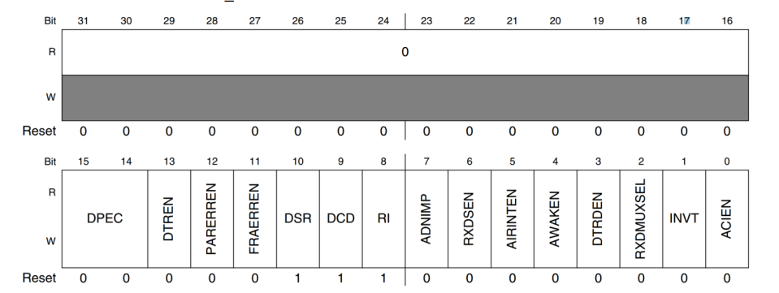
Bit 0 (ACIEN):

Function: Auto-baud Count Interrupt Enable
Description: Enables interrupts for the auto-baud rate counter.
Bit 1 (INVT):

Function: Invert Transmit Polarity
Description: Inverts the polarity of the transmitted data.
Bit 2 (RXDMUXSEL):

Function: Receive DMA Mux Selection
Description: Selects the source for the receive DMA.
Bit 3 (DTREN):

Function: Data Terminal Ready Enable
Description: Controls the Data Terminal Ready signal.
Bit 4 (AIRINTEN):

Function: Automatic IR Interrupt Enable
Description: Enables interrupts from the automatic infrared module.
Bit 5 (RXSEN):

Function: Receive Status Enable
Description: Enables status messages on receive operations.
Bit 6 (ADNIMP):

Function: Automatic Distinguish Noise Impulse
Description: Controls noise impulse detection during auto-baud.
Bit 7 (RI):

Function: Ring Indicator
Description: Monitors the status of the Ring Indicator signal.
Bit 8 (DCD):

Function: Data Carrier Detect
Description: Monitors the status of the Data Carrier Detect line.
Bit 9 (DSR):

Function: Data Set Ready
Description: Monitors the status of the Data Set Ready line.
Bit 10 (FRAERREN):

Function: Frame Error Interrupt Enable
Description: Enables interrupts on frame errors.
Bit 11 (PARERREN):

Function: Parity Error Interrupt Enable
Description: Enables interrupts on parity errors.
Bit 12 (DPEC):

Function: Data Polarity Error Check
Description: Checks and controls the polarity of the data received.
Bit 13 (DTREN):

Function: Data Terminal Ready Enable
Description: Controls the Data Terminal Ready signal (similar to Bit 3, could be a different mode or mislabel).
Bit 14 (AWAKEN):

Function: Wakeup Enable
Description: Enables the UART to wake up the device from a low power state.

## UARTx_USR2
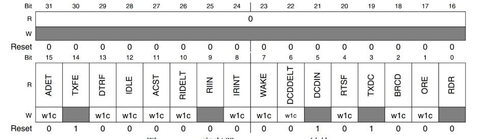
Bit 0 (RDR):

Function: Receive Data Ready
Description: Indicates that receive data is ready to be read. Clearing this bit acknowledges the reception.
Bit 1 (ORE):

Function: Overrun Error
Description: Indicates an overrun error has occurred. Writing a 1 clears this error flag.
Bit 2 (BRCD):

Function: Break Condition Detected
Description: Indicates that a break condition has been detected. Writing a 1 clears this flag.
Bit 3 (TXDC):

Function: Transmitter Done Clear
Description: Indicates that the transmitter is finished transmitting all data, including its shift register. Writing a 1 clears this flag.
Bit 4 (ITXF):

Function: Idle Line Transmit Flag
Description: Indicates the transmit line has returned to idle state after transmission. Writing a 1 clears this flag.
Bit 5 (DCON):

Function: Disconnected
Description: Indicates a disconnection condition (detected typically in a modem connection). Writing a 1 clears this flag.
Bit 6 (WAKE):

Function: Wakeup Flag
Description: Indicates that a wakeup condition was detected. Writing a 1 clears this flag.
Bit 7 (IRINT):

Function: Infrared Interrupt
Description: Indicates an event related to infrared communication. Writing a 1 clears this flag.
Bit 8 (RIELT):

Function: Ring Indicator Edge-Low Time
Description: Indicates the ring indicator signal went low. Writing a 1 clears this flag.
Bit 9 (ACST):

Function: Auto-baud Rate Calculation Status
Description: Indicates the status of auto-baud rate calculation. Writing a 1 clears this flag.
Bit 10 (IDLE):

Function: Idle Condition
Description: Indicates an idle condition was detected on the UART line. Writing a 1 clears this flag.
Bit 11 (DTRF):

Function: Data Terminal Ready Flag
Description: Indicates the DTR line status. Writing a 1 clears this flag.
Bit 12 (TXFE):

Function: Transmit FIFO Empty
Description: Indicates that the transmit FIFO is empty. Writing a 1 clears this flag.
Bit 13 (ADDET):

Function: Auto-baud Rate Detect
Description: Indicates the completion of auto-baud rate detection. Writing a 1 clears this flag.
**import bit**
1. TXDC(bit 3):
The transmission completion flag bit, when it is 1, indicates that the transmission buffer (TxFIFO) and shift register are empty, also
When the transmission is completed, this bit will be automatically cleared when data is written to TxFIFO.
2. RDR(bit 0):
data receive flag bit.
when it is 1, indicates receive at least 1 data.
After register UART_URXD receive data, the bit will be cleared.

## UARTx_UFCR、 UARTx_UBIR and  UARTx_UBMR
UARTx_UFCR(UART FIFO Control Register) 
UARTx_UBIR(UART BRM Incremental Register)
UARTx_UBMR(UART BRM Modulator Register)
When enabeling the automatic baud rate detection feature, these registers can config the baud rate.
UCFR (bit 9-7 RFDIV)
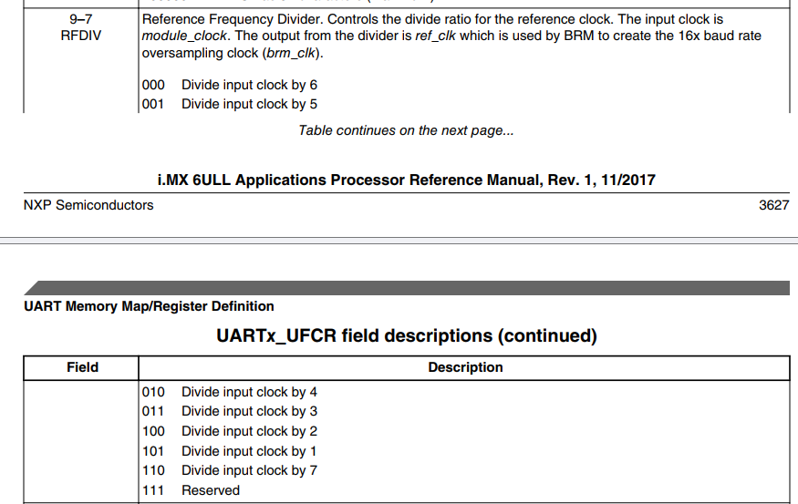
The divider is similar to the clock divider.
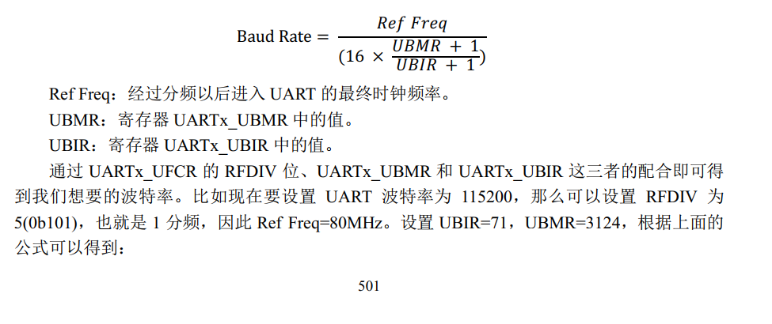

## URATx_URXD UARTx_UTXD
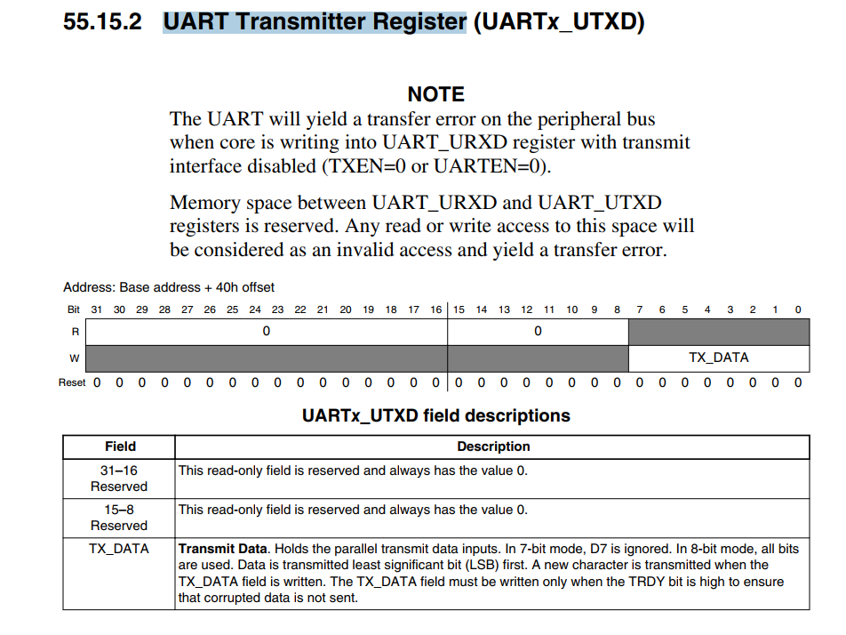
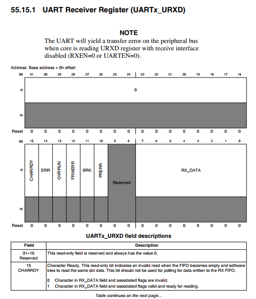
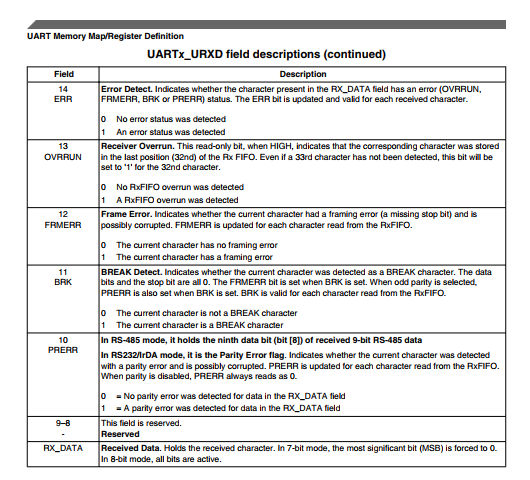
UART Receiver Register and UART Transmitter Register
their low 8 bit is the data we will receive or transmit.

# config the URAT
1. config the clock source of UART.
The clock source of the URAT is configed by the register CCM_CSCDR1 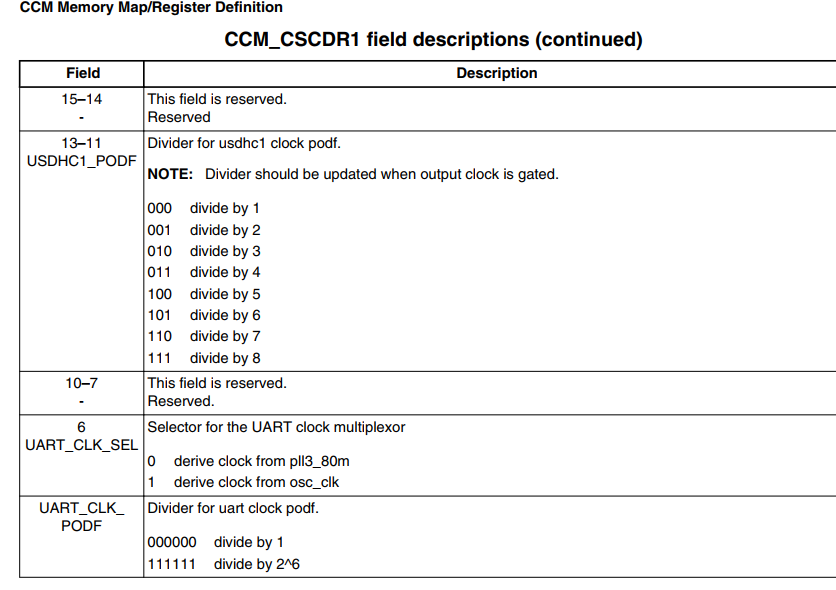

2. UART_init
    config the register UCR1~3

    config the regitser URXD and the UTXD

3.  enable UART
UART1_UCR1 bit 0(UARTEN)

4. fuction receive and transmit 

