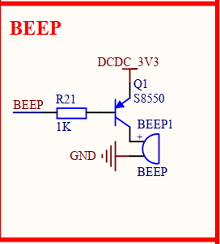

Lets enhance our understanding of GPIO

the diagram contains
1. R21(1k Ω)
2. Q1 S8550
a PNP transistor used as a switch to control the power supply to the buzzer.

3. Beep(嘟~可爱捏)
the pin is linked to the SNVS TAMPER BEEP
For the PNP transistor, when the SNVS TAMPER BEEP pin is low, Q1 is accessed by the buzzer, so the beep will 嘟嘟嘟~
  

the PAD value is same as led, so we use the 0x10B0
to config the electrical properties.
# Realize
Same as the LED.
1. Beepinit
IOMUX, PAD, DRIR, DR
2. same as led