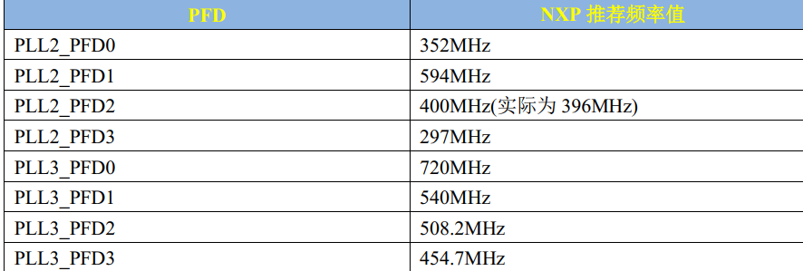

The core diagram, the 32.768khz crystal oscillator(晶振)

The 24Mhz provide the clock for the PAD.
We use the 24Mhz to generate the other 7 clock PLL

(MX6UP 350)
The 7 way pll, and the 7 pll generate PFD.

# CLOCK TREE
The diagram MU6U P 629

Through Clock generate we get conresponding clock source.

## System clocks
peripherals(外设)

## Example

This part is the clock source selector. ESAI has 4 optional clock sources: PLL4, PLL5, PLL3_PFD2 and
pll3_sw_clk. The specific choice of which channel to use as the clock source of ESAI is determined by the register CCM->CSCMR2
Determined by the ESAI_CLK_SEL bit, the user can configure it freely. The configuration is shown in Figure 16.1.3.3:

## PLL
**Phase Locked Loop，即锁相环**

①. ARM_PLL (PLL1), this PLL is used by the ARM core, and the ARM core clock is from this PLL
Generated, this PLL can be programmed to multiply frequencies up to 1.3GHz.
②. 528_PLL (PLL2), this PLL is also called **System_PLL**. This PLL has a fixed frequency of 22 and **cannot be programmed**.

Process modification. Therefore, this PLL clock = 24MHz * 22 = 528MHz, which is why this PLL is **called 528_PLL**
reason. This PLL branches out 4 channels of PFD, which are: **PLL2_PFD0~PLL2_PFD3**. These 4 channels of PFD and 528_PLL
Together, it serves as the root clock source for many other peripherals. Usually 528_PLL and these 4 PFDs are the internal system bus of I.MX6U
Clock source, such as internal processing logic unit, DDR interface, NAND/NOR interface, etc.

③. USB1_PLL (PLL3), this PLL is mainly used for USBPHY. This PLL also has four PFDs, which are:
PLL3_PFD0~PLL3_PFD3, USB1_PLL is **a fixed frequency multiplier of 20, so USB1_PLL=24MHz *20=480MHz.**
Although USB1_PLL is mainly used for USB1PHY, it and the four-way PFD can also be used as the root clock source for other peripherals.
This PLL branches out 4 channels of PFD, which are: **PLL3_PFD0~PLL3_PFD3**.

④. AUDIO_PLL (PLL4), this PLL is used for audio-related peripherals. The frequency multiplier of this PLL can be adjusted. PLL
The output range is also 650MHz~1300MHz. This PLL can also be frequency divided during the final output. Optional
1/2/4 frequency division **mainly for the Audio**
 
⑤.VIDEO_PLL (PLL5), this PLL is used for display-related peripherals, such as LCD. The frequency multiplication of this PLL can be
Adjust, the output range of PLL is 650MHz~1300MHz. This PLL can also perform frequency division during final output.
Optional 1/2/4/8/16 frequency division
**related to VIDEO, The blue one**

⑥.  ENET_PLL (PLL6), this PLL is fixed at 20+5/6 frequency multiplication, so ENET_PLL=24MHz * (20+5/6)
=500MHz. This PLL is used to generate the clock required by the network. 25/50/100/125MHz can be generated based on this PLL.
network clock. **mainly related to the Internet**

⑦. USB2_PLL (PLL7, there is no mistake! It is PLL7. Although the serial number is marked as 4, it is actually PLL7). Look at the name.
You can tell that this PLL is used by USB2PHY. Similarly, this PLL is fixed at 20 times the frequency, so it is also 480MHz.

**In daily use, we mainly init the PPL1(ARM),PLL2(system PLL), and PLL3(USB)**

## Config the clock frequency
MX6U p 645

## how to config arm frequency

P 648
PLL1=pll1_sw_sel
The **pll1_sw_clk is configed by the pll1_main_clock and sleep_clk**
We use the Register CCSR pll1_sw_clk_sel to choose which we use.
If the bit is 0, we choose pll1_main_clk, otherwise we choose the sleep_clock.
At the time we **change the ARM clock, we need to use the backup sleep_clock(24Mhz).**

The PLL frequency is configed by the 7-bit register field CCM_ANALOG_PLL_ARM[DIV_SELECT]
If we want the arm_clock=528Mhz=1056/2, PLL1=1056=24*88/2.

# realize
1. config the arm_clock 
CCM_ANALOG_PLL_ARM[DIV_SELECT]

config arm_pll CCM_ANALOG->

config the divider
At the time we change clock, we need to use the sleep_clock to make the PAD work properly.

2. config the PFD0 
config the PLL2_PFD0~3 frequency
config the PLL3_PFD0~3 frequency

PFDO_FRAC - Phase Fractional Divider Output Fraction

PFDO_CLKGATE - Phase Fractional Divider Output Clock Gate

PFDO_STABLE - Phase Fractional Divider Output Stable

