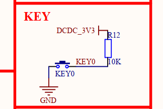
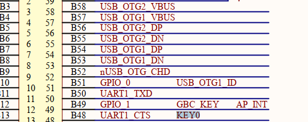
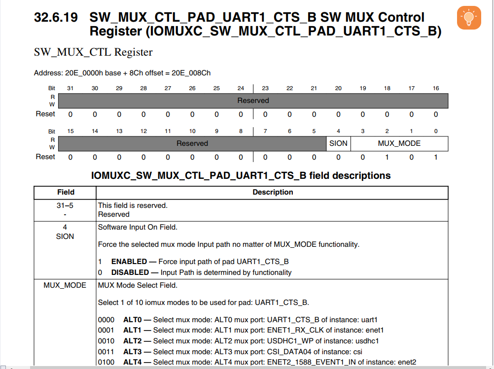
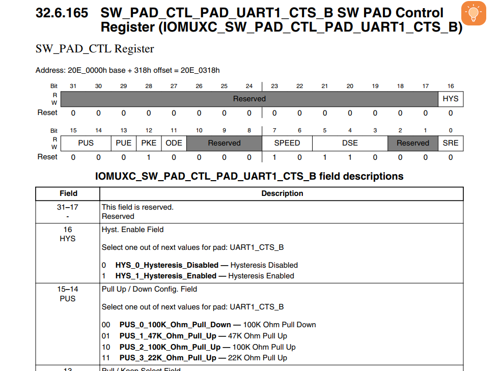

We use the GPIO output, the key Input can be used 
as GPIO input.

from the diagram we can see when we push the key button, the level of Key 
And so we can config the key from the pin
UART1 CTS.

The PAD config is almost same as the GPIO we meet before. 
Here we config it again .
And this is the OUTPUT GPIO 
    
    /*
bit 16 HYS 0:是否使能迟滞比较器 0
bit 15-14 00 选择一个100k下拉，在没有输入的时候是接地的，所以我认为选这个比较好
bit 13 0 选择一个keeper保持器
bit 12 1 使能keeper保持器
bit 11 0 是否使能开路输出，我这里选择的是不开启,我的理解是我选择的是下拉电阻，如果再选这个，那么没有上拉电阻将其拉到高电位，就g了
bit 10-8 000 reserved
bit 7-6  01 速率选择 01 选了个100MHZ(中庸之道),10也是100MHZ
bit 5-3  110 驱动强度 越往下，强度越高
bit 2-1 reserved 
bit 0 SRE 变化率快慢 0 因为变化率快了功耗高容易g?。
所以是 0001 0000 1011 000 0=0X10B0
    */ 
Here is the input GPIO we config
bit 16 HYS 0:是否使能迟滞比较器 0
bit 15-14 11 选择一个22k上拉，在没有输入的时候是高电平，所以我认为选这个比较好
bit 13 1 选择一个pull
bit 12 1 使能pull保持器
bit 11 0 是否使能开路输出，否
Same as GPIO output
bit 7-6  01 速率选择 01 选了个100MHZ(中庸之道),10也是100MHZ
bit 5-3  110 驱动强度 越往下，强度越高
bit 2-1 reserved 
bit 0 SRE 变化率快慢 0 因为变化率快了功耗高容易g?。
所以是0 1111 0000 1000 0000=0xF080
