Der Glaube kann Berge versetzen.

In this chapter, i will realize LED function on my own.
Firstly, we turn to the baseboard schematic diagram.
  
and this is the LED function diagram.
### 1.the triangle like symbol is the led  
with two arrows pointing away, indicating that it emits light.
when LED0 is low level, the led emits light.and the Red means the led is RED.
### 2.resistor(R6)(电阻器)
value:510R is 510 Ω
### 3.Power Supply(DCDC 3V3)

and it corresponds to the B47 pin. 
The GPIO 3 control the LED0.  
So we turn to the Register about GPIO.  
In the I.MX6ULL reference book chapter32 IOMUXC(I/O Multiplexer Controller)(多路复用功能)
the chapter can be mainly divided into 2 parts, IOMUXC SNVS Memory Map/Register Definition and IOMUXC Memory Map/Register Definition.  
The SNVS is refered to Secure Non-Volatile Storage which is related to senetive data. At this time, i do not use them.
Here we use IOMUXC_SW_MUX_CTL_PAD_GPIO1_IO03(IOMUX Control Software Mux Control Pad GPIO1_IO03)(PAD 物理焊盘或者引脚)( General Purpose Input/Output 1, Input/Output number 03) and   IOMUXC_SW_PAD_CTL_PAD_GPIO1_IO03
(**Here PAD is PAD control**)
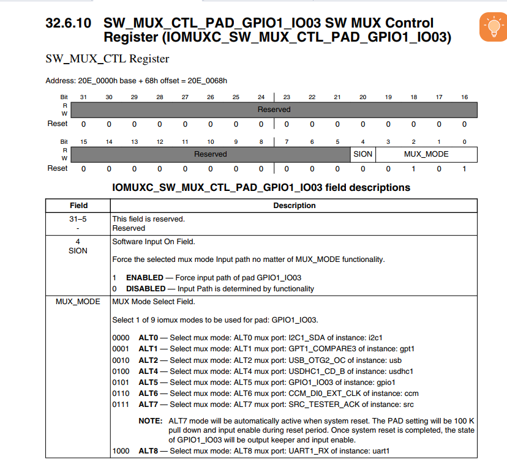
Here is the detailed information of the two registers combined with my understanding.

**1.Base Address**
IOMUXC_SW_MUX_CTL_PAD_GPIO1_IO03 Base is 20E_0000h base +68h offset=0X20E_0068h

Bit 4 (SION - Software Input On Field):

This bit is used to control the software input path independent of MUX_MODE settings.
1 (ENABLED): Forces the input path of pad GPIO1_IO03 to be active regardless of MUX_MODE.
0 (DISABLED): The input path is determined by the functionality set in MUX_MODE.
ME: In Dynamic Functionality Changes or Debuging??override the multiplexed function of a pin.  
**KEY POINT:input path(对引脚输入路径进行更改？)** 

bits 3-0 (MUX_MODE):

These bits select the mode of operation for the pin GPIO1_IO03.
Each setting corresponds to a different functionality:
0000 (ALT0): Configures the pin for I2C1_SDA (I2C data line).
0001 (ALT1): Configures the pin for GPT1_COMPARE3 (Timer comparison event).
0010 (ALT2): Configures the pin for USB_OTG2_OC (USB Over-Current event).
0100 (ALT4): Configures the pin for USDHC1_CD_B (SD Card detect).
0101 (ALT5): Configures the pin for default GPIO functionality.
0110 (ALT6): Configures the pin for CDM_EXI_CLK (External Clock).
0111 (ALT7): Configures the pin for SRC_TESTER_ACK (System Reset Controller Tester).
1000 (ALT8): Configures the pin for UART1_RX (UART receive line).

ALT0: I2C1_SDA
Function: Configures the pin as the Serial Data Line (SDA) for I2C bus 1.
Use: This mode is used for two-wire communication, typically for connecting low-speed peripherals like sensors, EEPROMs, or other microcontrollers.  
此模式用于两线通信，通常用于连接低速外设，如传感器、EEPROM 或其他微控制器。

ALT1: GPT1_COMPARE3(**General Purpose Timer**)
Function: Configures the pin for the third compare event of General Purpose Timer 1 (GPT1).  
Use: This is used in applications requiring precise timing measurements, such as generating time-based events or measuring time intervals.
这用于需要精确定时测量的应用程序，例如生成基于时间的事件或测量时间间隔。

ALT2: USB_OTG2_OC
Function: Configures the pin to detect Over-Current (OC) events for USB On-The-Go (OTG) port 2.
Use: Critical for protecting the USB port and connected devices from over-current conditions, enhancing the safety and reliability of USB connections.  
对于保护 USB 端口和连接的设备免受过流影响、增强 USB 连接的安全性和可靠性至关重要

ALT4: USDHC1_CD_B
Function: Configures the pin as the Card Detect (CD) signal for the Ultra Secure Digital Host Controller (USDHC1).
Use: It is used to detect the presence of an SD card in the slot, important for devices that read from or write to SD cards.
它用于检测插槽中是否存在 SD 卡，这对于读取或写入 SD 卡的设备非常重要。
 

ALT5: Default GPIO Functionality
Function: Configures the pin as a general-purpose input/output (GPIO).
Use: This versatile setting allows the pin to be used for a wide range of purposes, including interfacing with LEDs, buttons, or other simple I/O devices.  
其多功能设置允许该引脚用于多种用途，包括与 LED、按钮或其他简单 I/O 设备连接。
  

ALT6: CDM_EXI_CLK
Function: Configures the pin as an External Clock (EXI_CLK) source for the Clock Division Multiplexer (CDM).
Use: Useful in applications requiring an external clock source for timing critical operations or synchronizing multiple devices.  
在需要外部时钟源来对关键操作进行计时或同步多个设备的应用中非常有用。

ALT7: SRC_TESTER_ACK
Function: Configures the pin for acknowledgment signaling in a System Reset Controller (SRC) test environment.
Use: This mode is typically used in diagnostic or testing setups to signal test results or statuses from system reset tests.  
 此模式通常用于诊断或测试设置，以发出系统重置测试的测试结果或状态信号。  

ALT8: UART1_RX
Function: Configures the pin as the Receive (RX) line for UART1.
Use: Essential for serial communication, receiving data transmitted from other devices or computers, commonly used in debugging interfaces or communication between microcontrollers.  
对于串行通信至关重要，接收从其他设备或计算机传输的数据，常用于调试接口或微控制器之间的通信。
# GPIO diagram
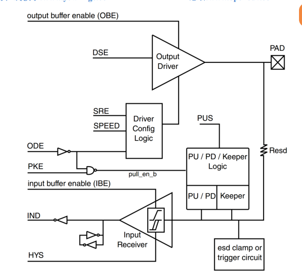

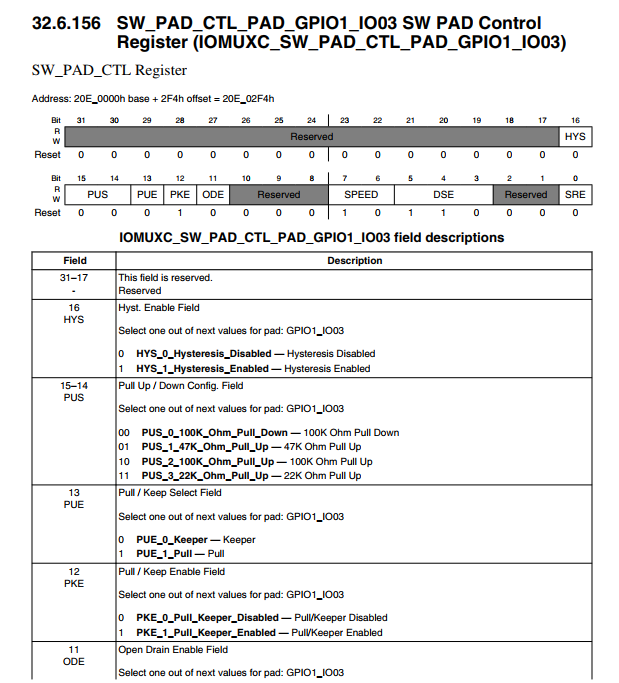  
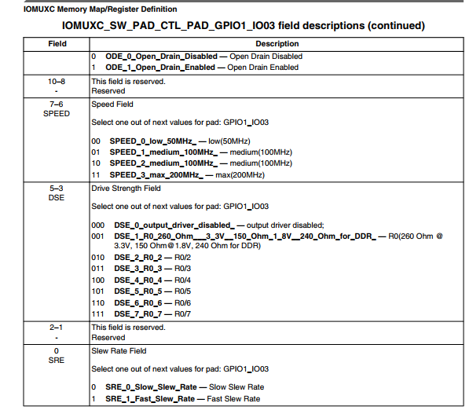

**HYS:bit 16**
enable 迟滞比较器
迟滞比较器的作用：
施密特触发器：当配置为输入时，如果启用迟滞比较器（Schmitt trigger），该触发器将使得输入信号具有一定的迟滞特性。这意味着输入信号需要超过一定的高阈值才能识别为高电平，而转为低电平则需要低于一个较低的阈值。这种两个阈值的设置增加了系统对噪声的抵抗能力，有助于防止由于信号边缘的微小波动而产生错误的信号边缘检测。

**PUS(bit15:14)：** 
配置上拉电阻与下拉电阻
PUS 位的作用和选项：
上下拉电阻：上下拉电阻用于确保引脚在未连接输入时具有一个确定的电平状态。上拉电阻将引脚拉至高电平（通常是供电电压），而下拉电阻则将引脚拉至低电平（通常是地线）。这些设置对于数字电路中输入引脚的稳定性至关重要。
PUS 配置选项：
00 - 100K 下拉：

功能：配置100千欧的下拉电阻。
应用场景：适用于需要确保引脚在无驱动信号时保持低电平的情况，如按钮输入等。
01 - 47K 上拉：

功能：配置47千欧的上拉电阻。
应用场景：适用于需要较强上拉力以确保引脚在无输入时为高电平的应用，常用于与开关相连的输入引脚。
10 - 100K 上拉：

功能：配置100千欧的上拉电阻。
应用场景：当不需要很强的上拉力时适用，如某些通讯接口的空闲线状态保持。
11 - 22K 上拉：

功能：配置22千欧的上拉电阻。
应用场景：提供最强的上拉力，适用于环境干扰大或长距离传输信号的场景，确保引脚状态清晰无误。

**PUE:13bit**
控制引脚是否使用上下拉电阻或是状态保持器（Keeper）
PUE 位的功能：
上下拉电阻：当启用上下拉电阻时，引脚将连接到一个固定的上拉或下拉电阻，确保在没有驱动信号时，引脚能够保持在一个确定的高电平或低电平状态。
状态保持器（Keeper）：状态保持器用于在引脚没有活动驱动时保持其最后的状态。这意味着，如果引脚被驱动为高电平，然后驱动去除，保持器将保持引脚在高电平；相反，如果是低电平，同样会保持低电平状态。这对于减少引脚状态变化所需的功耗特别有用。
PUE 位的配置选项：
0 - 使用状态保持器：

功能：配置状态保持器功能，保持引脚在没有活动输入时的最后状态。
应用场景：适用于需要最小化功耗和避免由于引脚状态不确定而引发的错误。这在传感器接口或中断引脚中尤为重要，特别是在电源可能不稳定的应用中。
1 - 使用上下拉：

功能：启用连接到引脚的上下拉电阻，确保引脚在无输入信号时具有稳定的逻辑电平。
应用场景：适用于那些在电路设计中需要明确的信号电平保证的情况，比如在长距离信号传输或电气噪声较高的环境中。

**PKE:bit 12**
位用来使能或者禁止上下拉/状态保持器功能，
为0 时禁止上下拉/状态保持器，为 1 时使能上下拉和状态保持器
**ODE(bit11)**：对应图 8.1.4.2 中的 ODE，当 IO 作为输出的时候，此位用来禁止或者使能开路输出，此位为 0 的时候禁止开路输出， 当此位为 1 的时候就使能开路输出功能.  
(开路输出（Open Drain Output）是电子电路中的一个术语，它指的是一种输出方式，其中输出端不直接驱动到高电平状态，而是依赖外部的上拉电阻将电压拉到高电平。在没有外部上拉电阻的情况下，输出端仅能拉低至地（GND），而不能自行推至高电平。)  

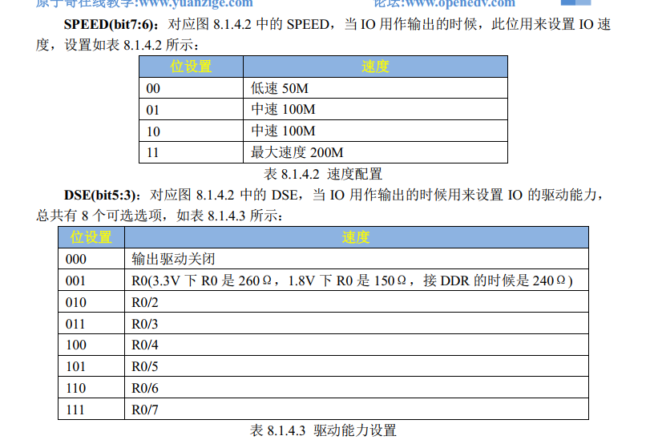

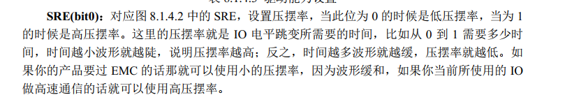

# How GPIO works
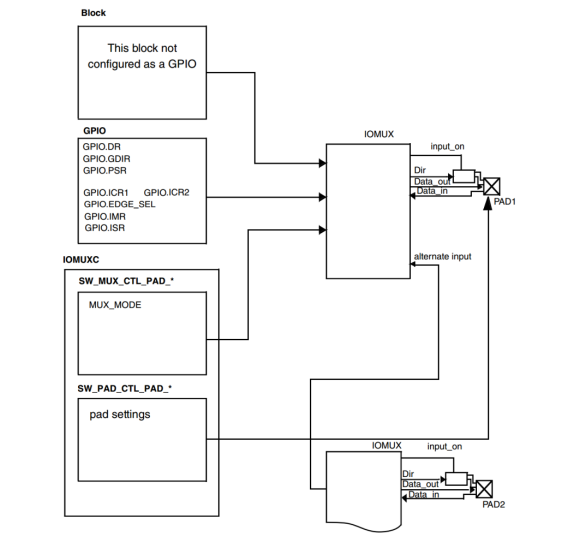
Key Components
GPIO Block

This block manages the basic settings and operations of the GPIO pins.
Components:
**GPIO_DR** (Data Register): Manages output levels on the GPIO pins.  
if the GPIO_GDIR is configured as an output, its value is the GPIO outputvalue, else GDIR configured as an input, its value is input value.  

**GPIO_GDIR** (Direction Register): Configures pins as either inputs or outputs. v 
input :0; output :1.  

**GPIO_PSR** (Pad Status Register): Reads the current status of GPIO pins.  
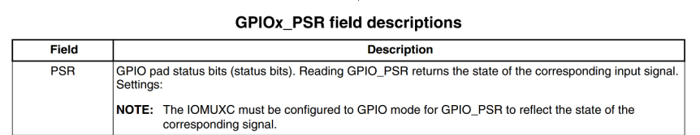

**GPIO_ICR1 and GPIO_ICR2** (Interrupt Configuration Registers): Configure interrupt generation conditions.

**GPIO_EDGE_SEL (Edge Select)**: Determines what type of edge (rising, falling) triggers an interrupt.can override ICR1 and ICR2

**GPIO_IMR**(Interrupt Mask Register): Enables or disables interrupts.  

**GPIO_ISR** (Interrupt Status Register): Indicates which GPIO pin has triggered an interrupt.  
When interrupt happens, ISR is set 1. When interrupts end, we need to clear it. 
IOMUX
~~FickenFickenFickenFickenFickenFicken~~

The IOMUX connects the configured GPIO settings.
The Pad configures the electrical characteristics of the pads.

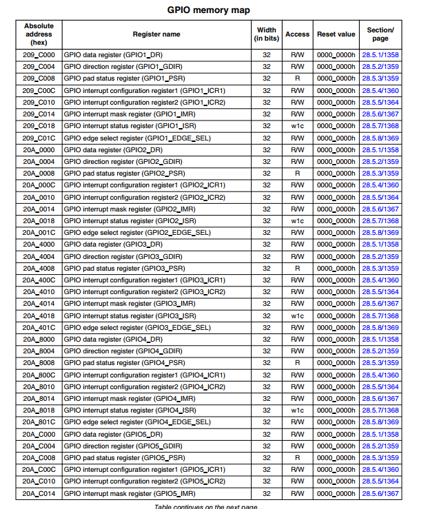
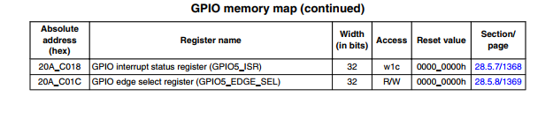

Last，we need to enable clock at first step.
My understanding: we need enable clock to make program works in order.
And the clock register is CCM_CCGR0~6, which can be found at I.MX6ULL 
p669.

we need to find the GPIO_io03_clock.
we find it in CCM_CCGR2.
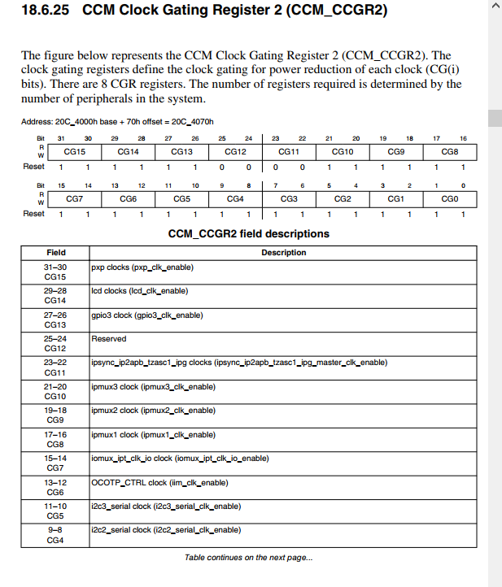
Lets write the code.  
第一步，使能时钟。
第二步，设置GPIO1 IOMUX 和pad
和GPIO的寄存器属性。 
第三步，跳转到main
第四步，操作LED DR，反复亮。

next step we will code Makefile
1.we want the .o file ()
we need to decide the address to link(After soon we will use link file)

