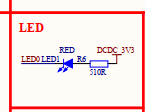
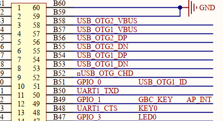

Der Glaube kann Berge versetzen.

In this chapter, i will realize LED function on my own.
Firstly, we turn to the baseboard schematic diagram.
  
and this is the LED function diagram.
### 1.the triangle like symbol is the led  
with two arrows pointing away, indicating that it emits light.
when LED0 is low level, the led emits light.and the Red means the led is RED.
### 2.resistor(R6)(电阻器)
value:510R is 510 Ω
### 3.Power Supply(DCDC 3V3)

and it corresponds to the B47 pin. 
The GPIO 3 control the LED0.  
So we turn to the Register about GPIO.

