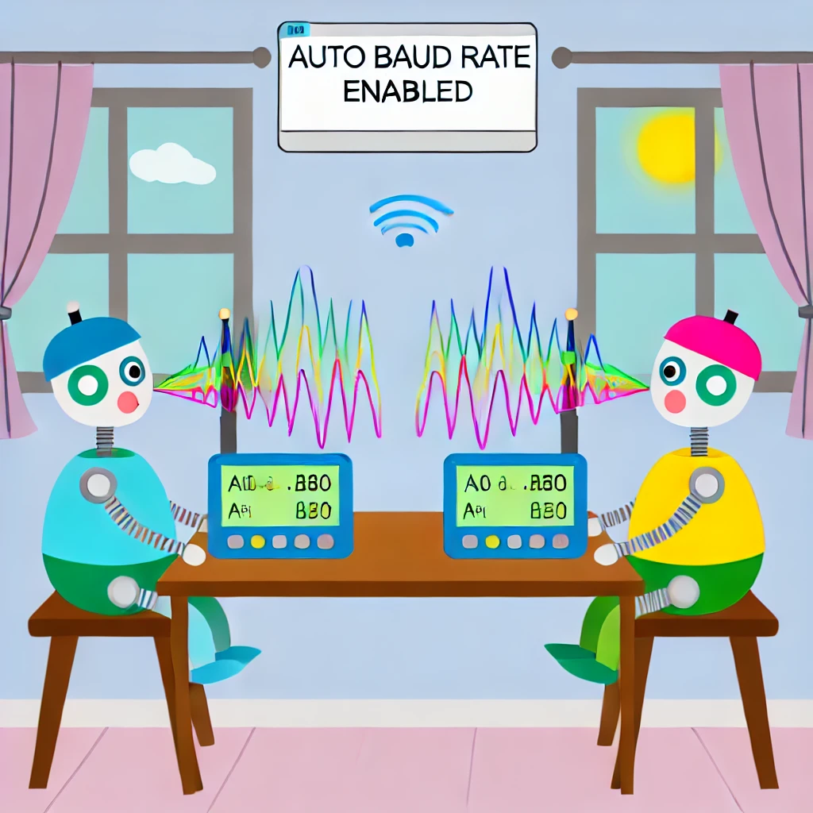

When we say "Enables automatic detection of the baud rate", imagine that this is a way for a computer or device to learn and understand on its own how fast to receive information from another device.

Here's a simple example: Let's say you and a friend are chatting over a walkie-talkie. If your friend talks too fast or too slow, you may need to tell them to adjust their speed so you can better understand what they are saying. In the world of computers and devices, "baud rate" is the "speed of speech." If one device can automatically detect and match the "speaking speed" of another device, they can communicate better, without errors and confusion.

So, when a device has the "auto-detect baud rate" feature enabled, it's like becoming smarter and automatically adjusting itself to match the speed of another device, ensuring a smooth conversation between them. This is very important to maintain the accuracy and efficiency of communication between devices!