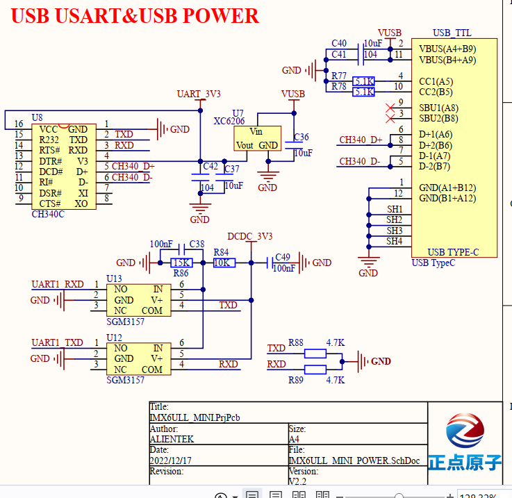

In this diagram, we can see the chip CH340C, it transfers the USB to TTL. So the PAD can understant the command from USB (which is translated to TTL).
And the Capacitors and resistors help us work properly in High interference environment

# main chip 
This is the main chip, which is used to convert USB signals into TTL signals so that USB devices can communicate with serial devices.
TXD (pin 2): Transmit Data, send data, send data from the USB end to the peripheral.
RXD (pin 3): Receive Data, receive data, receive data from the peripheral to the USB end.
D+ (pin 4) and D- (pin 5): These are the data lines of the USB interface, used to transmit data.
V3 (pin 6): 3.3 volt power input.
CTS# (pin 9) and DSR# (pin 10): Clear to Send and Data Set Ready, these are flow control signals, used to control data transmission.

VCC (Pin 1):

Function: Power input (positive voltage)

R232 (Pin 15):

Function: Reserved pin

RTS# (Pin 13):

Function: Request to Send

DTR# (Pin 12):

Function: Data Terminal Ready

DCD# (Pin 11):

Function: Data Carrier Detect
.
XI (pin 8) and XO (pin 7):

Function: Crystal oscillator connection points

# Voltage regulator XC6206 (U7)
Voltage regulator XC6206 (U7)(电压调节器)

Vin: Voltage Input, voltage input, receives power from VUSB (5 volt power supply at USB end).

Vout: Voltage Output, voltage output, outputs 3.3 volts to power CH340C chip.

GND: Ground, ground wire, used for common ground of circuit.